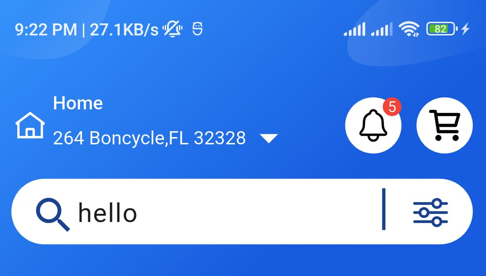
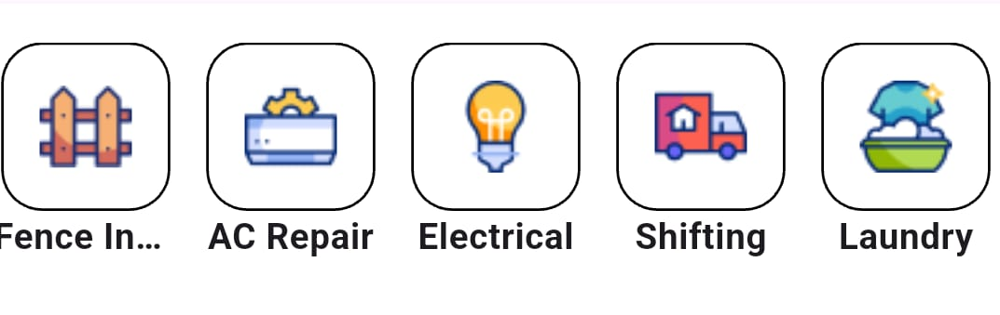
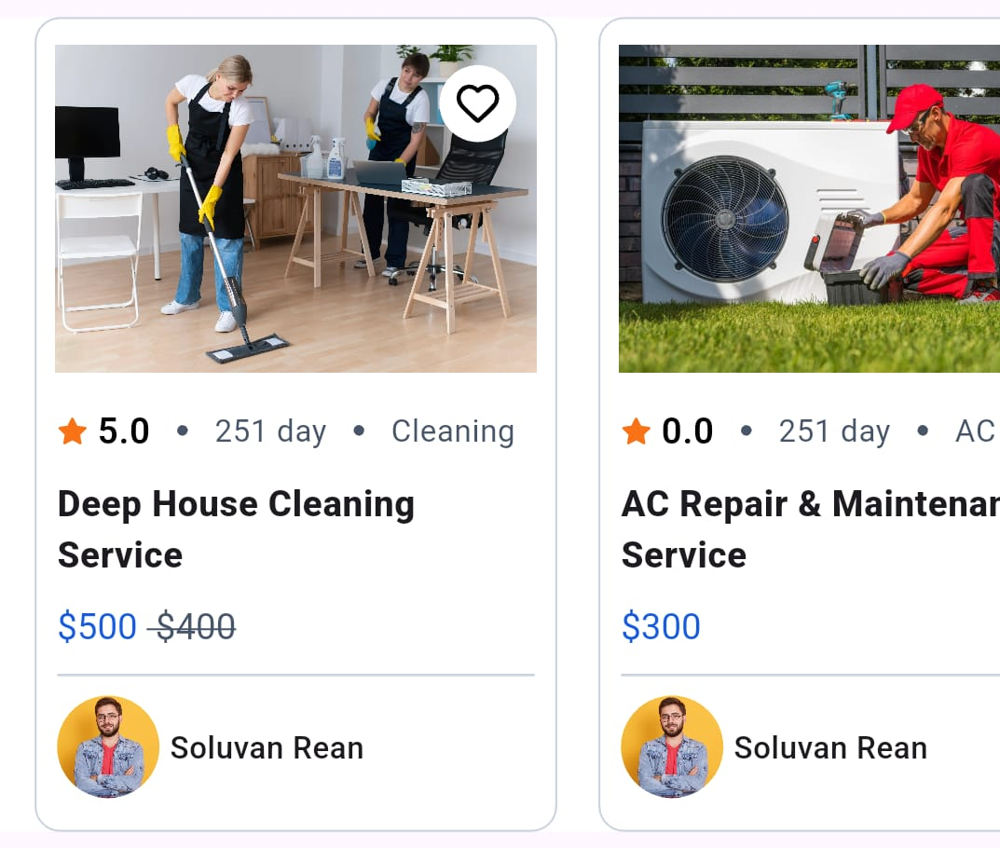
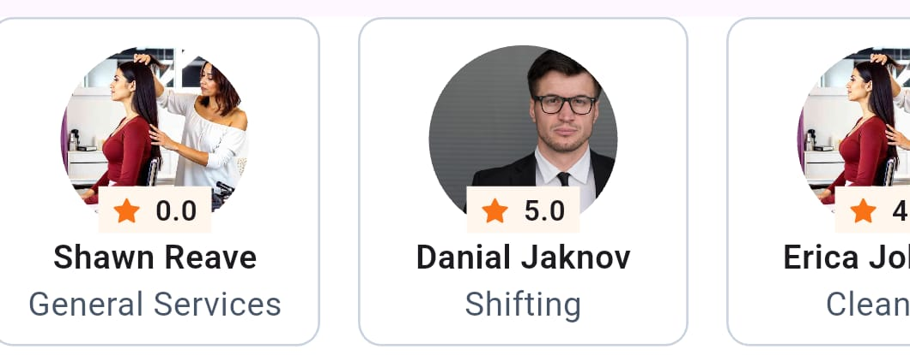
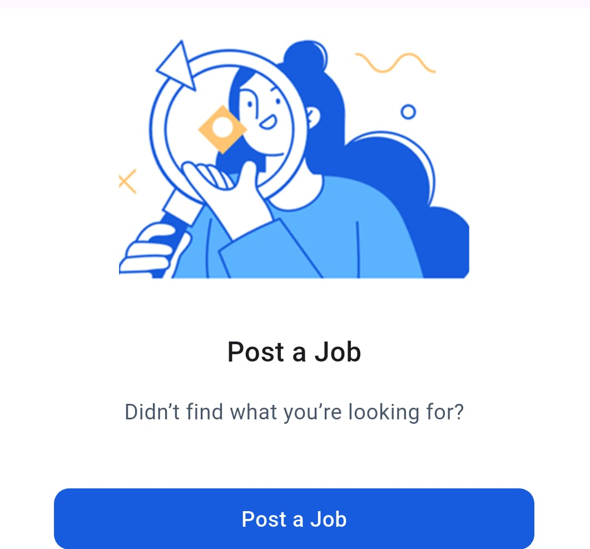

#task_project

## Getting Started

Follow these steps to clone and run the project:

 ## 1. **Clone the repository**
    ```bash
    git clone <repository-url>
    cd task_project
    code .
    ```

## 2. **Install dependencies**
    ``` bash
    flutter create .
    flutter pub get
  ```

## 2. **Run Project**
    ``` bash
    flutter run
  ```

## 4. **Package uses**
     - carousel_slider: ^4.2.0 [uses for slider section]
     - flutter_svg: ^1.1.0 [uses for svg icons and images]
     - flutter gen  [ to get exact path of assets ]
## 5. **Project Structure**
```
lib
├── gen                          # Path of assets is here
├── page_view                   # Bottom navigation control is here
├── src
│   ├── component               # Custom widgets are here
│   ├── constants               # All constants like colors, data list of all sections
│   └── ui
│       └── pages               # All pages are here
│           └── features        # All features are here
│               ├── category                   # Category section and its components
│               │   └── widget                 # Custom card of category
│               ├── person_with_ratting        # Person_with_ratting section and its components
│               │   └── widget                 # Custom card of person_with_ratting
│               ├── Search job                # Search job section file
│               ├── service_section           # Service_section and its components
│               │   └── widget                 # Custom card of service_section
│               └── slider_section            # Slider_section and its components
│                   └── widget                 # Custom card of slider_section
```
## 6. **ScreenShots**
  **app bar section**
   - 
 **category section**
   - 
  **service section**
   - 
  **slider section**
   - 
  **person with ratting section**
   - 
  **search job section**
   - 
  **bottom navigation bar**
   - 